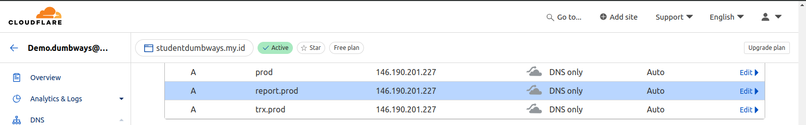

# Pengerjaan Test

Berikut dokumentasi pengerjaan tugas test. Saya menggunakan VM dari digitalocean untuk mengerjakan tugas.


## Docker
Di setiap folder sudah terdapat dockerfile yang dibuat untuk melakukan build masing masing service. 
- Dockerfile ui
  ```
  FROM node:20-alpine

  WORKDIR apps

  COPY . .

  RUN npm install

  EXPOSE 3000

  CMD ["npm", "run", "dev"]
  ```
- Dockerfile trx
  ```
  FROM golang:alpine AS build

  WORKDIR /apps

  COPY . .

  RUN go build -o my-golang-app

  FROM alpine:latest AS production

  WORKDIR /apps

  COPY --from=build /apps/my-golang-app .

  EXPOSE 8000

  CMD ["./my-golang-app"]

  ```
- Dockerfile report
  ```
  FROM python:alpine

  WORKDIR /app

  COPY . .

  RUN pip install --no-cache-dir fastapi uvicorn

  EXPOSE 5000

  CMD ["uvicorn", "main:app", "--host", "0.0.0.0", "--port", "5000", "--reload"]
  ```
  Selanjutnya tinggal menjalankan aplikasi dengan perintah
  ```
  docker compose up -d 
  ```
  

## Webserver
Terdapat folder webserver yang berisi konfigurasi untuk nginx serta cerbot untuk certificate SSL menggunakan docker compose, adapun langkah yang dikerjakan antara lain :
- Penyiapan kredensial yang akan digunakan certbot untuk mendapatkan certificate SSL menggunakan plugin cloudflare.
- Melakukan generate SSL certificate dengan perintah `docker compose up -d certbot`
- Membuat file nginx.conf yang bakan dimasukan ke dalam container nginx agar aplikasi dapat diakses menggunakan domain.
- Melakukan setting domain pada cloudflare
  
- Jalankan docker compose untuk nginx dengan perintah `docker compose up -d nginx`
- Akses domain dev.studentdumbways.my.id
  

## Kubernetes
Saya menggunakan DigitalOcean Kubernetes untuk melakukan deployment, pada folder kubernetes terdapat yaml file  untuk masing masing service beserta ingress-nginx, langkah-langkah yang dikerjakan sebagai berikut:
- Melakukan install terlebih dahulu ingress-controller
  ```
  kubectl apply -f https://raw.githubusercontent.com/kubernetes/ingress-nginx/controller-v1.10.1/deploy/static/provider/cloud/deploy.yaml
  ```
- Menyiapkan SSL certificate menggunakan metode wildcard dan mengubah privkey dan fullchain menjadi base64 yang kemudian dibuat menjadi secret dalam deployment.
  ```
  kubectl apply -f tls-cert.yaml
  ```
- Selanjutnya melakukan setting domain pada cloudflare
  
- Jalankan semua deployment dengan menggunakan perintah 
  ```
  kubectl apply -f .
  ```
  Periksa pods yang berjalan, kemudian akses domain prod.studentdumbways.my.id
  
  


## Continious Integration
Saya mengerjakan continious integration dengan bitbucket menggunakan pipeline di mana semua proses test, build hingga push ke docker registry berjalan di atas docker container. Adapun langkah yang saya kerjakan antara lain :
1. Menyiapkan SSH key agar repository dapat pull dan push repository
2. Menyiapkan variables yang akan digunakan dalam pipeline yml file untuk login ke dalam docker registry
3. Membuat script bitbucket-pipelines.yml seperti berikut :
    ```
    image: docker:20.10.7

    pipelines:
      default:
        - step:
            name: Test Service
            caches:
              - docker
            services:
              - docker
            script:
              - echo "Running Go test for trx service..."
              - docker run --rm -v $(pwd)/trx:/app -w /app golang:1.22 bash -c "go test"
              - echo "Running pytest for report service..."
              - docker run --rm -v $(pwd)/report:/app -w /app python:3 bash -c "pip install -r requirements.txt && pytest"
        - step:
            name: Build and Push to Docker
            caches:
              - docker
            services:
              - docker
            script:
              - echo "Building Docker image for trx service..."
              - docker login -u $DOCKERHUB_USERNAME -p $DOCKERHUB_PASSWORD
              - docker build -t $DOCKERHUB_USERNAME/trx:latest ./trx
              - docker push $DOCKERHUB_USERNAME/trx:latest
              - echo "Building Docker image for report service..."
              - docker build -t $DOCKERHUB_USERNAME/report:latest ./report
              - docker push $DOCKERHUB_USERNAME/report:latest
              - echo "Building Docker image for ui service..."
              - docker build -t $DOCKERHUB_USERNAME/ui:latest ./report
              - docker push $DOCKERHUB_USERNAME/report:latest
    ```
  